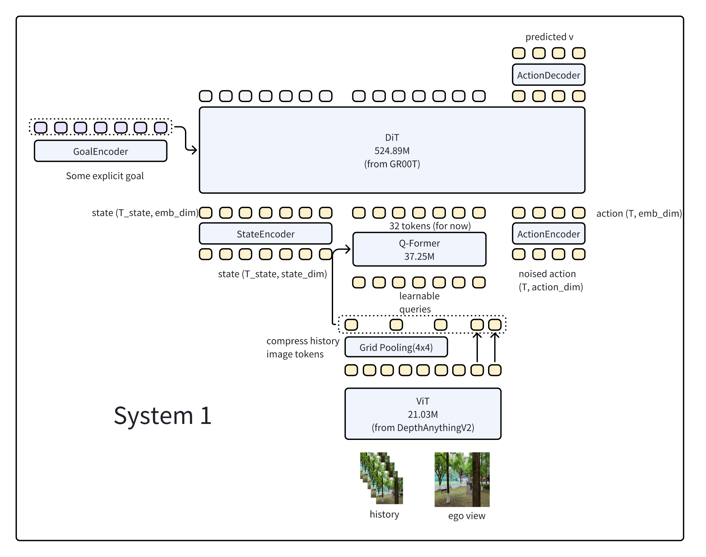

# xNav
xNav is an ambitious project aiming to realize a true dual-system Vision-Language-Action (VLA) model for intelligent language navigation.

## Environment Setup
We use uv to manage this project. Use following command to setup the environment.
```bash
uv sync
uv pip install -e .
```

## System 1
### Export Model
Run following command to export model with GR00T action head and DepthAnythingV2 ViT
```bash
uv run xnav/module/export_xnav_dit.py
```

### Model Archetecture
**System 1**

